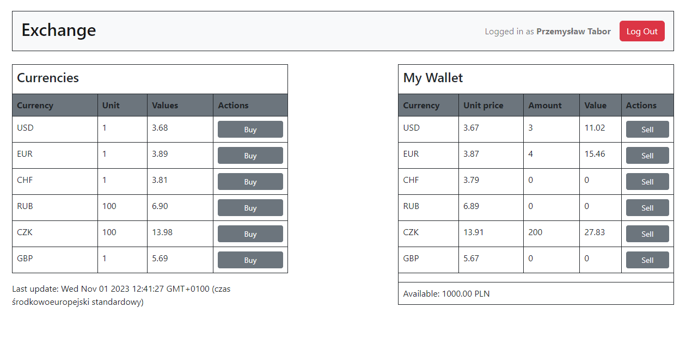
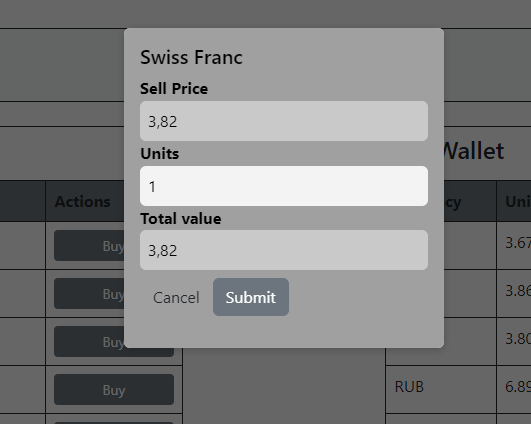
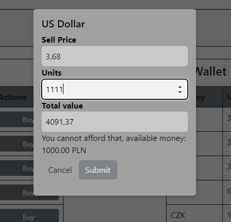

# Exchange app
This is an app created as a task for self-study react package.

### Features: 
 - Buy/sell currencies
 - Wallets are stored in database per user
 - Multiple users can use the exchange in the same time
 - Currencies data is fetched from API and refreshed regularly
 - Validation for all fields

## Instalation
1. `npm install` - installs packages
2. `npm run dev` - runs the app
3. `npm test` - runs the tests

This app require another backend application that can be found here: https://github.com/PrzemyslawTabor/Exchange-backend

## Screens:
### Main view:

### Buying currencies

### Example validation
